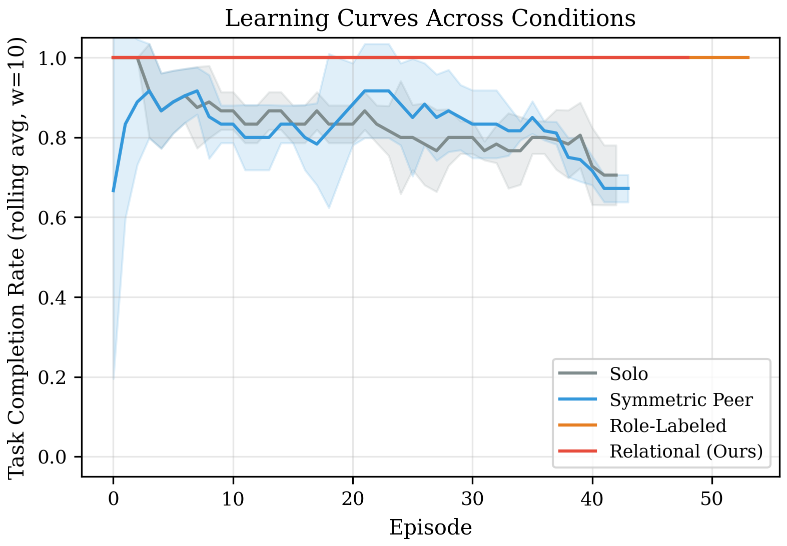
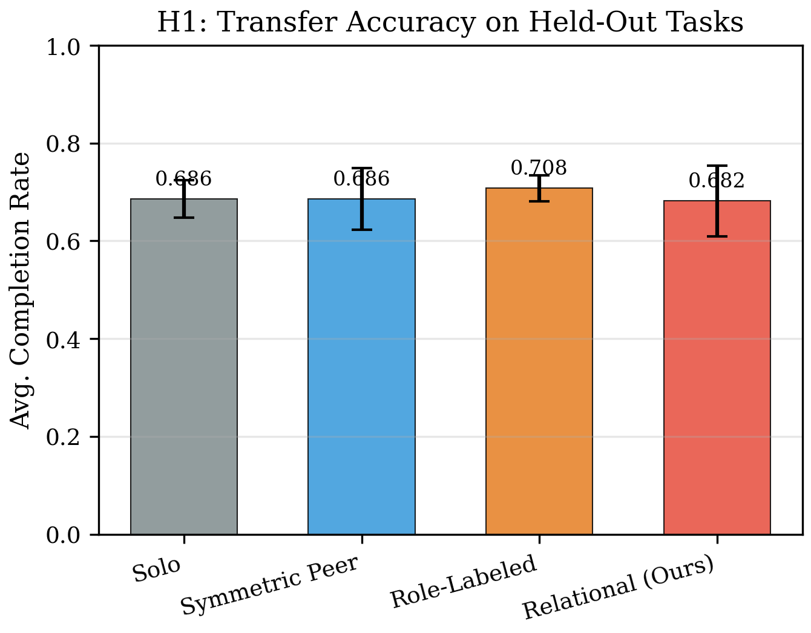
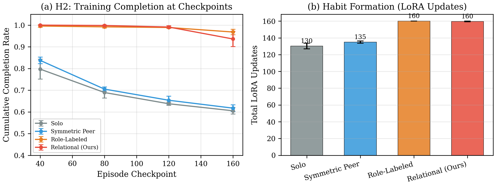
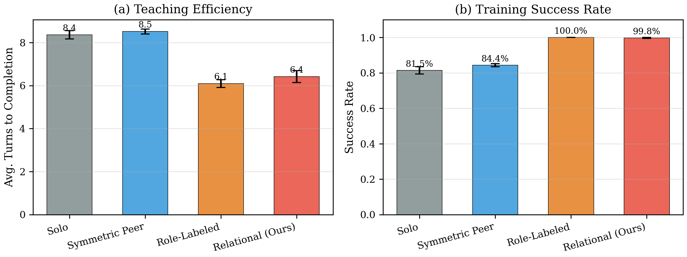
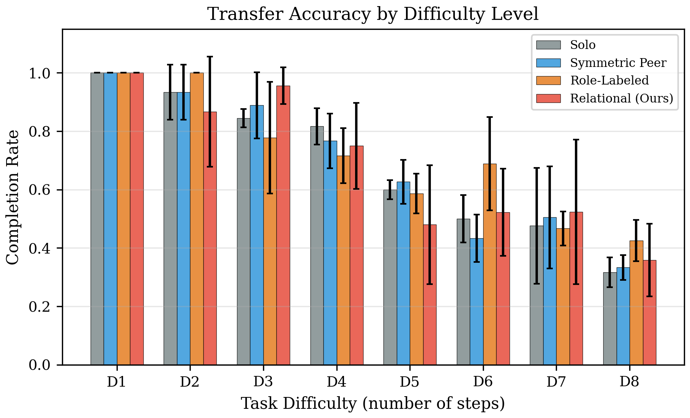
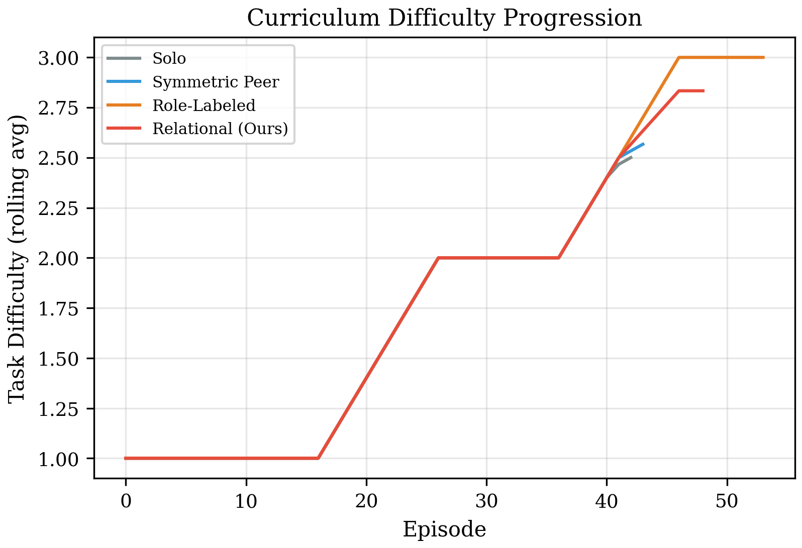
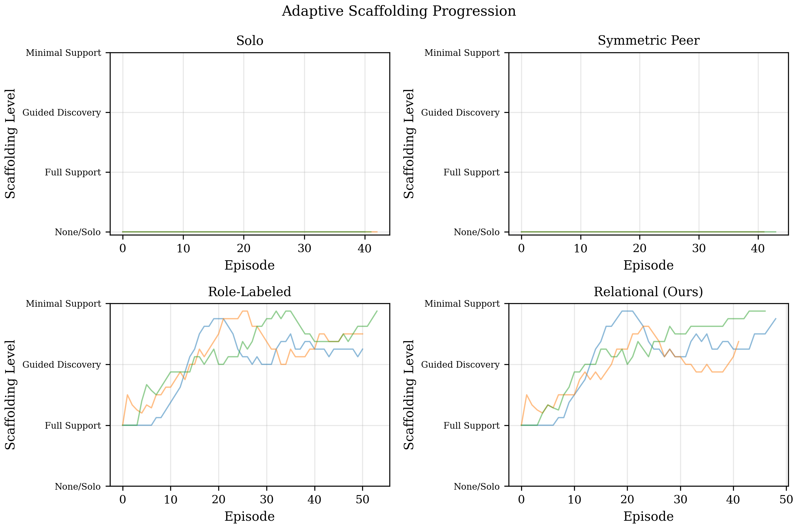
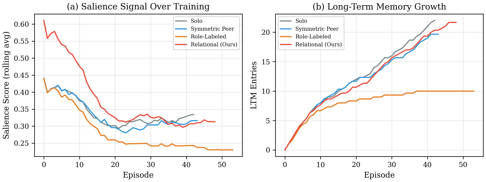
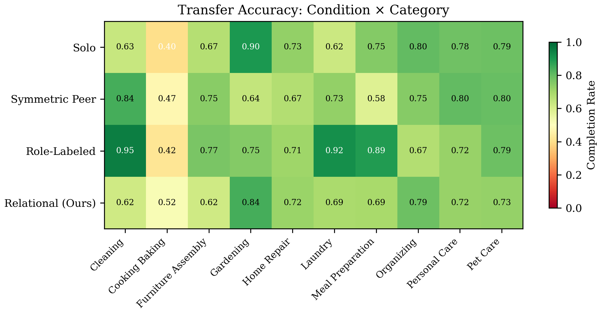

<h1 align="center">Can Adding Asymmetric Relation Dynamics<br>Make Knowledge Transfer More Efficient<br>in Language Agents?</h1>

<p align="center">
  <a href="https://www.python.org/downloads/"></a>
  <a href="https://github.com/rishi-more-2003/asym-rel-eff-kt"></a>
  <a href="https://github.com/rishi-more-2003/asym-rel-eff-kt/blob/master/documentation/final_report.tex"></a>
  <a href="https://github.com/rishi-more-2003/asym-rel-eff-kt"></a>
</p>

<p align="center">
  <b>EN.601.773 Machine Social Intelligence &middot; Spring 2026 &middot; Johns Hopkins University</b><br>
  <a href="mailto:rmore2@jhu.edu">Rishi More</a>
</p>

<p align="center">
  <a href="documentation/final_report.pdf"><b>Paper</b></a> &nbsp;|&nbsp;
  <a href="documentation/presentation.tex"><b>Slides</b></a> &nbsp;|&nbsp;
  <a href="documentation/proposal.tex"><b>Proposal</b></a>
</p>

---

## TL;DR

> A **Qwen3-235B caregiver** teaches a **Qwen3-8B child** across **160 household tasks** using a cognitively-inspired memory architecture and a **salience-gated consolidation** mechanism. Caregiver-assisted agents achieve **100 % training success** with **25 % fewer turns**, but this advantage **does not transfer** to independent evaluation — mirroring the *scaffolding dependency* phenomenon from developmental psychology.

---

## Overview

Human learning is fundamentally relational: caregivers curate information, model the child's knowledge state, and scaffold within the Zone of Proximal Development. Current language agent training ignores this structure entirely.

This project asks: **does an asymmetric caregiver–child relationship enable a language agent to acquire richer and more generalizable knowledge?** We operationalize this through:

- A **four-module memory architecture** inspired by Tulving's taxonomy (instinct buffer, working memory, episodic long-term memory, LoRA-based habits)
- A **salience signal** combining novelty, prediction error, and a teaching signal grounded in natural pedagogy theory
- Four experimental conditions compared across **12 concurrent runs** (4 conditions &times; 3 seeds)

---

## Key Results

<table>
<tr>
<td width="50%">

<p align="center"><sub><b>Learning Curves</b> — Caregiver conditions maintain near-perfect completion as curriculum difficulty increases.</sub></p>
</td>
<td width="50%">

<p align="center"><sub><b>H1: Transfer Accuracy</b> — Despite training gaps, all conditions transfer similarly to held-out tasks.</sub></p>
</td>
</tr>
</table>

<table>
<tr>
<td width="50%">

<p align="center"><sub><b>H2: Habit Acceleration</b> — Caregiver conditions achieve 100 % success and 160/160 LoRA updates vs. ~130 for Solo/Peer.</sub></p>
</td>
<td width="50%">

<p align="center"><sub><b>Teaching Efficiency</b> — Caregiver: 6.1 turns avg vs. Solo/Peer: 8.4 turns (25 % reduction).</sub></p>
</td>
</tr>
</table>

<table>
<thead>
<tr>
<th align="left">Metric</th>
<th align="center">Solo</th>
<th align="center">Sym. Peer</th>
<th align="center">Role-Labeled</th>
<th align="center"><b>Relational</b></th>
</tr>
</thead>
<tbody>
<tr>
<td align="left">H1 Transfer Accuracy</td>
<td align="center">0.686 &plusmn; 0.046</td>
<td align="center">0.686 &plusmn; 0.078</td>
<td align="center"><b>0.708 &plusmn; 0.033</b></td>
<td align="center">0.682 &plusmn; 0.087</td>
</tr>
<tr>
<td align="left">Training Success Rate</td>
<td align="center">81.5 %</td>
<td align="center">84.4 %</td>
<td align="center"><b>100 %</b></td>
<td align="center">99.8 %</td>
</tr>
<tr>
<td align="left">Avg. Turns to Complete</td>
<td align="center">8.36</td>
<td align="center">8.52</td>
<td align="center"><b>6.10</b></td>
<td align="center">6.42</td>
</tr>
<tr>
<td align="left">Total LoRA Updates</td>
<td align="center">130</td>
<td align="center">135</td>
<td align="center"><b>160</b></td>
<td align="center">160</td>
</tr>
</tbody>
</table>

> **Key finding:** Caregiver presence dramatically accelerates training, but the child becomes *dependent* on scaffolding — when evaluated alone, the advantage vanishes. This mirrors Wood, Bruner & Ross's (1976) scaffolding dependency in developmental psychology.

---

## Method

### Memory Architecture

The child agent maintains four memory modules, each mapping to a cognitive analogue:

```
┌─────────────────────────────────────────────────────┐
│                  Child Agent (8B)                   │
│                                                     │
│  ┌──────────┐  ┌──────────┐  ┌──────────────────┐   │
│  │ M1       │  │ M2       │  │ M3               │   │
│  │ Instinct │  │ Working  │  │ Long-Term Memory │   │
│  │ Buffer   │  │ Memory   │  │ (Episodic Store) │   │
│  │          │  │ (k=8)    │  │ + BM25 Retrieval │   │
│  └──────────┘  └──────────┘  └────────┬─────────┘   │
│                                       │             │
│                              salience > τ ?         │
│                                       │             │
│                              ┌────────▼─────────┐   │
│                              │ M4  Habit Store  │   │
│                              │ (LoRA rank=16)   │   │
│                              └──────────────────┘   │
└─────────────────────────────────────────────────────┘
```

| Module | Implementation | Updated |
|:---|:---|:---:|
| **M1.** Instinct Buffer | Fixed system prompt with role priors | Never |
| **M2.** Working Memory | Sliding window of last *k* = 8 dialogue turns | Every turn |
| **M3.** Long-Term Memory | Episodic store with BM25 retrieval and 235B compression | If salience > &tau; |
| **M4.** Habit Store | LoRA adapter (rank 16, lr = 2e-5, batch &ge; 4) | Salience-weighted SFT |

### Salience Signal

$$s = \alpha \cdot \text{novelty}(e) \;+\; \beta \cdot \text{prediction\\_error}(e) \;+\; \gamma \cdot \text{teaching}(e)$$

| Component | Weight | Mechanism |
|:---|:---:|:---|
| **Novelty** | &alpha; = 0.3 | Category frequency decay + BM25 distance to existing LTM |
| **Prediction Error** | &beta; = 0.4 | Rescorla-Wagner surprise + ZPD match (Gaussian at *r* = 0.5) |
| **Teaching Signal** | &gamma; = 0.3 | Productive struggle patterns + effort ratio; &gamma; = 0 without caregiver |

### Experimental Conditions

| Condition | Agents | Teaching Signal | Scaffolding |
|:---|:---|:---:|:---:|
| Solo | 8B child alone | &gamma; = 0 | &mdash; |
| Symmetric Peer | Two 8B agents | &gamma; = 0 | &mdash; |
| Role-Labeled | 235B caregiver + 8B child | &gamma; = 0 | Adaptive |
| **Relational** | 235B caregiver + 8B child | **&gamma; = 0.3** | Adaptive |

---

## Getting Started

### Prerequisites

- Python 3.10+
- [Tinker API](https://thinkingmachines.ai/tinker/) key

### Installation

```bash
git clone https://github.com/rishi-more-2003/asym-rel-eff-kt.git
cd asym-rel-eff-kt

python -m venv .venv
source .venv/bin/activate      # Linux / macOS
# .venv\Scripts\activate       # Windows

pip install -r requirements.txt
```

### Configuration

Create a `.env` file in the project root:

```ini
TINKER_API_KEY="your-tinker-api-key-here"
```

All hyperparameters are centralized in [`config.py`](config.py).

---

## Usage

### 1. Generate Task Database

```bash
python run_generate_tasks.py
```

Runs the multi-stage pipeline (**ontology &rarr; skeletons &rarr; expansion &rarr; verification &rarr; filtering**) to produce 197 household tasks. Output: `data/task_database.json`.

### 2. Run Experiments

```bash
# Full pipeline (training + evaluation)
python run_experiment.py all

# Or run phases separately
python run_experiment.py train    # 12 concurrent runs (4 conditions × 3 seeds)
python run_experiment.py eval     # Evaluate on 40 held-out tasks
```

### 3. Generate Figures

```bash
python analyze_results.py
```

Produces publication-quality figures in `documentation/figures/`.

---

<details>
<summary><b>Project Structure</b> (click to expand)</summary>

```
asym-rel-eff-kt/
├── config.py                    # Centralized hyperparameters
├── run_generate_tasks.py        # Task generation entry point
├── run_experiment.py            # Training + evaluation entry point
├── analyze_results.py           # Figure generation
├── requirements.txt
│
├── src/
│   ├── agents/
│   │   ├── caregiver.py         # 235B frozen caregiver agent
│   │   └── child.py             # 8B trainable child agent with LoRA
│   ├── memory/
│   │   ├── instinct.py          # M1: Fixed behavioral priors
│   │   ├── working_memory.py    # M2: Sliding window (k=8)
│   │   └── long_term.py         # M3: Episodic store + BM25 retrieval
│   ├── salience.py              # Salience signal (novelty + pred. error + teaching)
│   ├── trainer.py               # M4: Salience-weighted LoRA SFT
│   ├── episode.py               # Async episode runner
│   ├── training.py              # Concurrent training loop
│   ├── evaluation.py            # H1 / H2 / H3 evaluation suite
│   ├── judge.py                 # Semantic action judge (235B)
│   ├── scaffolding.py           # Adaptive scaffolding controller
│   ├── child_model.py           # Caregiver's model of the child
│   ├── curriculum.py            # Difficulty-ordered curriculum
│   ├── conditions.py            # Experimental condition configs
│   ├── bm25.py                  # Dependency-free BM25
│   ├── reward.py                # Reward computation
│   ├── metrics_logger.py        # JSONL metrics logging
│   ├── tinker_utils.py          # Tinker API utilities
│   ├── ontology.py              # Object ontology generation
│   ├── generate_skeletons.py    # Task skeleton generation
│   ├── expand_tasks.py          # Full task expansion
│   ├── verify_tasks.py          # Self-verification loop
│   └── filter_tasks.py          # Dedup + balancing + train/eval split
│
├── data/
│   ├── task_database.json       # Generated task database (197 tasks)
│   ├── object_ontology.json     # Household object ontology
│   ├── task_skeletons.json      # Intermediate skeletons
│   └── runs/                    # Experiment outputs
│       ├── evaluation_results.json
│       └── {condition}_seed{n}/
│           ├── metrics.jsonl    # Per-episode metrics
│           ├── ltm.json         # Long-term memory state
│           └── transcripts/     # Full episode dialogues
│
└── documentation/
    ├── final_report.tex         # Full paper
    ├── presentation.tex         # Beamer slides
    ├── proposal.tex             # Project proposal
    ├── bibliography.bib         # References
    └── figures/                 # Generated figures (PDF + PNG)
```

</details>

---

## Additional Figures

<details>
<summary><b>Transfer by Difficulty</b></summary>
<br>

<p><sub>All conditions handle easy tasks well; performance degrades similarly on hard tasks.</sub></p>
</details>

<details>
<summary><b>Curriculum &amp; Scaffolding</b></summary>
<br>
<table>
<tr>
<td width="50%">

<p align="center"><sub><b>Curriculum Progression</b></sub></p>
</td>
<td width="50%">

<p align="center"><sub><b>Adaptive Scaffolding</b></sub></p>
</td>
</tr>
</table>
</details>

<details>
<summary><b>Salience &amp; LTM Growth</b></summary>
<br>

<p><sub>Salience decays as tasks become familiar; caregiver conditions accumulate more LTM entries.</sub></p>
</details>

<details>
<summary><b>Category Heatmap</b></summary>
<br>

<p><sub>Transfer accuracy by condition and task category. No single condition dominates all categories.</sub></p>
</details>

---

## Citation

If you find this work useful, please cite:

```bibtex
@misc{more2026asymrel,
  title   = {Can Adding Asymmetric Relation Dynamics Make Knowledge Transfer
             More Efficient in Language Agents?},
  author  = {More, Rishi},
  year    = {2026},
  url     = {https://github.com/rishi-more-2003/asym-rel-eff-kt}
}
```

## Acknowledgements

This project uses the [Tinker API](https://thinkingmachines.ai/tinker/) for LLM inference and LoRA fine-tuning. Experiments were run on the JHU CS research compute cluster. Total API cost: ~$45.

Built as part of **EN.601.773 Machine Social Intelligence** at Johns Hopkins University.

---

<p align="center"><sub>Made with care at JHU &middot; Spring 2026</sub></p>
